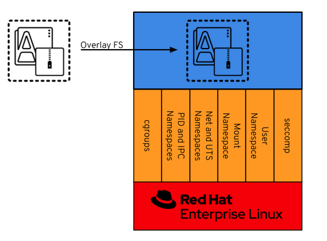
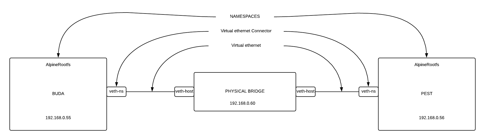

= Containers From Scratch
:toc: macro
:sectanchors:
:sectnumlevels: 2
:sectnums: 
:source-highlighter: pygments
:imagesdir: ../images
// Start: Enable admonition icons
ifdef::env-github[]
:tip-caption: :bulb:
:note-caption: :information_source:
:important-caption: :heavy_exclamation_mark:
:caution-caption: :fire:
:warning-caption: :warning:
endif::[]
ifndef::env-github[]
:icons: font
endif::[]
// End: Enable admonition icons

// Create the Table of contents here
toc::[]

I will try to explain through simple examples how *linux namespaces* technology is used to create that thing we call *containers*. But what a *container* is?, there are many info in blogs, articles over internet generally speaking about containers, according to that we can said that a *container* is isolated process running on a host. Container runtimes takes advantage over some pretty cool Linux kernel technologies that you might have overheard as namespaces, cgroups, chroots, etc. plus security layers like SELinux or Seccomp.

Container runtime have different approaches, in Docker tehy'll get their own namespace, meanwhile in CoreOS’ rkt, will be grouped and containers will share namespaces, each of which is called a pod.

We will see how we can leverage these technologies on Linux in order to build and run our own containers, and then we will contrast it against kubernetes / openshift

== Tools
=== Container Tools 

To be able to get the job done, we will need access to machine with basics container tools, like the following:

* Buildah builds
* Podman runs
* Skopeo transfers container images.
* Container-selinux
* Containernetworking-plugins
* Fuse-overlayfs
* slirp4netns


I will be using a RHEL8/Fedora server. The tools I've mentioned before could be installed through package modules, which will make our life easier.  

```bash
$ sudo dnf module install container-tools -y
$ sudo dnf install -y jq tree
$ pip3 install yq --user
```
=== cli tools 

TIP: for Windows users can install https://git-scm.com/download/win[git bash], which emulates a bash environment on windows. It lets you use all git features in command line plus most of standard unix commands. It has a portable version, very useful in the following chapters due all examples are linux based.

==== About the OpenShift CLI

With the OpenShift command-line interface (CLI), the oc command, you can create applications and manage OpenShift Container Platform projects from a terminal. The OpenShift CLI is ideal in the following situations:

* Working directly with project source code
* Scripting OpenShift Container Platform operations
* Managing projects while restricted by bandwidth resources and the web console is unavailable

==== Installing the OpenShift CLI

Check the documentation https://docs.openshift.com/container-platform/4.7/cli_reference/openshift_cli/getting-started-cli.html[getting started cli]

==== Installing the OpenShift CLI on Linux

You can install the OpenShift CLI (oc) either by downloading the binary or by using an RPM. we are going to download the binaries following the procedure: 

```bash
# Set variable openshift_cli to get lastest binary version 

$ openshift_cli=$(curl -s https://mirror.openshift.com/pub/openshift-v4/clients/ocp/latest/ | grep -E "openshift-client-linux-.*.tar.gz" | sed -r 's/.*href="([^"]+).*/\1/g')

# Download the binary

$ curl https://mirror.openshift.com/pub/openshift-v4/clients/ocp/latest/$openshift_cli --output $openshift_cli

# Uncompress the binary at the /usr/local/bin/ path 

$ tar -xvzf $openshift_cli -C /usr/local/bin/
$ oc completion bash >/etc/bash_completion.d/openshift
```

== Container File Systems (a.k.a rootfs)

It could be said that _container images_ are a buch of _unchangeable_ static files compresses into a tarball. At the very end, in _Linux_ everithing is a file.

TIP: There are many ways to build a _rootfs_ up as many tools to do it, i.e. https://buildroot.org/[buildroot].

For the following examples we are going to download an already build rootfs for Alpine Linux. 

```bash
$ mkdir ~/rootfs ;cd ~/rootfs

$ ALPINE_MINIROOT_FILENAME=$(curl -s https://dl-cdn.alpinelinux.org/alpine/latest-stable/releases/x86_64/latest-releases.yaml| yq -r '.[]| select(.file|test("alpine-minirootfs"))|.file')

$ curl https://dl-cdn.alpinelinux.org/alpine/latest-stable/releases/x86_64/$ALPINE_MINIROOT_FILENAME -o rootfs.tar.gz
``` 

We are going to create two temporary folders and then extract the rootfs.

```bash
$ mkdir /var/tmp/{buda,pest} 
$ tar xfz rootfs.tar.gz -C /var/tmp/buda/
$ tar xfz rootfs.tar.gz -C /var/tmp/pest/
```

If we take a look at the extracted files

```bash
 $ tree -L 1 /var/tmp/buda/
```

As you can see, the resulting directory looks like a Linux system. We have some well known directories in the Linux Filesystem Hierarchy Standard such as: __bin__, __tmp__, __dev__, __opt__, __etc__.

```bash
/var/tmp/buda/
├── bin
├── dev
├── etc
├── home
├── lib
├── media
├── mnt
├── opt
├── proc
├── root
├── run
├── sbin
├── srv
├── sys
├── tmp
├── usr
└── var
```
== chroot 

The first tool we are going to discover will be https://en.wikipedia.org/wiki/Chroot[chroot]. which basically, is an operation that will allows us to restrict a process’ view of the file system, changing the apparent root directory for the current running process and its children.

Now we can use the Alpine Linux rootfs we've already downloaded and  restric the process to this rootfs, in other words will be chrooted it.

* Create the chroot jail.

```bash
$ sudo chroot /var/tmp/buda /bin/sh
```
 
* Check the OS release 

```bash
$ cat /etc/os-release
NAME="Alpine Linux"
ID=alpine
VERSION_ID=x.y.z
PRETTY_NAME="Alpine Linux vx.y"
HOME_URL="https://alpinelinux.org/"
BUG_REPORT_URL="https://bugs.alpinelinux.org/"
```

* Install python and run a simple http server for example:

```bash
$ echo "nameserver 8.8.8.8" > /etc/resolv.conf
$ apk add python3
$ python3 -m http.server
```

NOTE: When we execute the Python interpreter we’re actually running it from /var/tmp/buda/usr/bin/python3, which is the rootfs of out chrooted env.

* If you open a new terminal on your system (even if it’s outside of the chroot) you will be able to reach the http server we just created:

```bash
$ curl http://127.0.0.1:8000
```

== Namespaces

Until now, we are able to work with a tarball, that acts as a complete different system from our host, but all we've done so far really isolated our processes from the host? 

Let's have a look into it, to check if we are acting as a container.

* In a shell in the host, outside the chroot run a ping command:

```bash
$ ping 127.0.0.1
```

* Mount the proc filesystem inside the chrooted shell

```bash
$ mount -t proc proc /proc
```

* Run a ps command inside the chroot and try to find the ping command:

```bash
$ ps -ef | grep "ping 127.0.0.1"
```

* We have visibility over the host system processes, that’s not great. On top of that, our chroot is running as root so we can even kill the process:

```bash
$ pkill -f "ping 127.0.0.1"
```

Now we can talk about namespaces.

**Linux namespaces** are a feature of the Linux kernel that allow the isolated environment to have a different state than the host even though they are sharing a Kernel.

The contents of the filesystem are typically provided by an image file and the environment exists as a chroot process in the filesystem.

The network stack inside the container is constructed with the Linux network stack primitives to share a connection with the host without worrying about conflicting port numbers.

.Kernel Namespaces


In figure above, the sandboxed container environment can be seen as the blue box. The orange boxes are the Kernel Namespaces and they are as follows:

.Kernel Namespaces
[cols=3*,cols="1,2,5",options="header"]
|===
| Cgroup
| Isolates
| Summary

|cgroups
a|
- Cgroup root directory
|cgroups allow limits to be placed on a process and its children. Primarily, these are used for limiting CPU and RAM usage. 

|IPC 
a|
- System V IPC
- POSIX message queues
|The Inter-Process Communication (IPC) Namespace limits the processes ability to share memory.

|Network
a|
- Network devices
- stacks
- ports, etc.
|The Network Namespace allows a new network stack to exist in the sandbox. This means our sandboxed environment can have its own network interfaces, routing tables, DNS lookup servers, IP addresses, subnets…​ you name it!.

|Mount
a|
- Mount points
|The Mount Namespace is the part of the Kernel that stores the mount table. When our sandboxed environment runs in a new Mount Namespace, it can mount filesystems not present on the host.

|PID
a|
- Boot and monotonic clocks
| The PID namespace allows a process and its children to run in a new process tree that maps back to the host process tree. The new PID namespace starts with PID 1 which will map to a much higher PID in the host’s native PID namespace.

|User
a|
- User and group IDs
| The User Namespaces allow our sandboxed environment to have its own set of user and group IDs that will map to very high, unique, user and group IDs back on the host system. They also allow the root user in the sandbox to be mapped to another user on the host.

|UTS
a|
- Hostname and NIS domain name
| The Unix Time Sharing (UTS) Namespace exists solely for storing the system’s hostname. 

|===

=== Creating namespaces with unshare

Creating namespaces is just a single syscall (unshare). There is also a unshare command line tool that provides a nice wrapper around the syscall.

We are going to use the unshare command line to create namespaces manually. Below example will create a PID namespace for the chrooted shell:

    * Exit the chroot we have already running.

    * Create the PID namespace and run the chrooted shell inside the namespace  

```bash
$ sudo unshare -p -f --mount-proc=/var/tmp/buda/proc chroot /var/tmp/buda/ /bin/sh
```

    * Now that we have created our new process namespace, we will see that our shell thinks its PID is 1:
```bash
$ ps -ef
```
NOTE: As you can see, we no longer see the host system processes

```bash
     PID   USER     TIME  COMMAND
     1 root      0:00 /bin/sh
     2 root      0:00 ps -ef
```

    * Since we didn’t create a namespace for the network we can still see the whole network stack from the host system:
```bash
 $ ip -o a
```
NOTE: Below output might vary on your system

```bash
# ip ad
1: lo: <LOOPBACK,UP,LOWER_UP> mtu 65536 qdisc noqueue state UNKNOWN qlen 1000
    link/loopback 00:00:00:00:00:00 brd 00:00:00:00:00:00
    inet 127.0.0.1/8 scope host lo
       valid_lft forever preferred_lft forever
    inet6 ::1/128 scope host 
       valid_lft forever preferred_lft forever
2: eth0: <BROADCAST,MULTICAST,UP,LOWER_UP> mtu 1500 qdisc fq_codel state UP qlen 1000
    link/ether 52:54:00:97:cd:5b brd ff:ff:ff:ff:ff:ff
    inet 10.0.0.50/24 brd 10.0.0.255 scope global eth0
       valid_lft forever preferred_lft forever
    inet6 fe80::5054:ff:fe97:cd5b/64 scope link 
       valid_lft forever preferred_lft forever
```

=== Entering namespaces with nsenter

One powerful thing about namespaces is that they’re pretty flexible, for example you can have processes with some separated namespaces and some shared namespaces. One example in the Kubernetes world will be containers running in pods: Containers will have different PID namespaces but they will share the Network namespace.

There is a syscall (setns) that can be used to reassociate a thread with a namespace. The nsenter command line tool will help with that.

We can check the namespaces for a given process by querying the `/proc` filesystem:

NOTE: Below commands must be run from a shell outside the chroot:

    * From a shell outside the chroot get the PID for the chrooted shell:

```bash
    $ UNSHARE_PPID=$(ps -ef | grep "sudo unshare" | grep chroot | awk '{print $2}')
    $ UNSHARE_PID=$(ps -ef | grep ${UNSHARE_PPID} | grep chroot | grep -v sudo | awk '{print $2}')
    $ SHELL_PID=$(ps -ef | grep ${UNSHARE_PID} | grep -v chroot |  grep /bin/sh | awk '{print $2}')
    $ ps -ef | grep ${UNSHARE_PID} | grep -v chroot |  grep /bin/sh
```

```bash
    root        4209    4208  0 17:08 pts/0    00:00:00 /bin/sh
```    


    * From a shell outside the chroot get the namespaces for the shell process:

```bash
$ sudo ls -l /proc/${SHELL_PID}/ns
```
```bash
total 0
lrwxrwxrwx. 1 root root 0 Apr 12 17:18 cgroup -> 'cgroup:[4026531835]'
lrwxrwxrwx. 1 root root 0 Apr 12 17:18 ipc -> 'ipc:[4026531839]'
lrwxrwxrwx. 1 root root 0 Apr 12 17:18 mnt -> 'mnt:[4026532293]'
lrwxrwxrwx. 1 root root 0 Apr 12 17:18 net -> 'net:[4026531992]'
lrwxrwxrwx. 1 root root 0 Apr 12 17:18 pid -> 'pid:[4026532294]'
lrwxrwxrwx. 1 root root 0 Apr 12 17:18 pid_for_children -> 'pid:[4026532294]'
lrwxrwxrwx. 1 root root 0 Apr 12 17:18 user -> 'user:[4026531837]'
lrwxrwxrwx. 1 root root 0 Apr 12 17:18 uts -> 'uts:[4026531838]'
```

    * Earlier we saw how we were just setting a different PID namespace, let’s see the difference between the PID namespace configured for our chroot shell and for the regular shell:
```bash
$ sudo ls -l /proc/${SHELL_PID}/ns/pid
lrwxrwxrwx. 1 root root 0 Apr 12 17:18 /proc/4209/ns/pid -> 'pid:[4026532294]'
```

    * Get PID namespace for the regular shell:
```bash
$ sudo ls -l /proc/$$/ns/pid
lrwxrwxrwx. 1 ansible ansible 0 Apr 12 17:19 /proc/1255/ns/pid -> 'pid:[4026531836]'
```

    * As you can see, both processes are using a different PID namespace. We saw that network stack was still visible, let’s see if there is any difference in the Network namespace for both processes. Let’s start with the chrooted shell:

```bash
$ paste <(sudo ls -l /proc/${SHELL_PID}/ns/net| awk '{print $9,$NF}') <( sudo ls -l /proc/$$/ns/net| awk '{print $9,$NF}')

/proc/4209/ns/net net:[4026531992]	/proc/1255/ns/net net:[4026531992]
```

    * As you can see from above outputs, both processes are using the same Network namespace.


If we want to join a process to an existing namespace we can do that using nsenter, as we said before. Let’s do that.

Open a new shell outside the chroot.

We want run a new chrooted shell and join the already existing PID namespace we created earlier:

```bash
# Get the previous unshare PPID
 $ UNSHARE_PPID=$(ps -ef | grep "sudo unshare" | grep chroot | awk '{print $2}')
 # Get the previous unshare PID
 $ UNSHARE_PID=$(ps -ef | grep ${UNSHARE_PPID} | grep chroot | grep -v sudo | awk '{print $2}')
 # Get the previous chrooted shell PID
 $ SHELL_PID=$(ps -ef | grep ${UNSHARE_PID} | grep -v chroot |  grep /bin/sh | awk '{print $2}')
 # We will enter the previous PID namespace, remount the /proc filesystem and run a new chrooted shell
 $ sudo nsenter --pid=/proc/${SHELL_PID}/ns/pid unshare -f chroot /var/tmp/pest/ /bin/sh

```

```bash
$ mount -t proc proc /proc

$ ps -ef
PID   USER     TIME  COMMAND
    1 root      0:00 /bin/sh
   13 root      0:00 unshare -f chroot /var/tmp/pest/ /bin/sh
   14 root      0:00 /bin/sh
   15 root      0:00 ps -ef
```

    * We have entered the already existing PID namespace used by our previous chrooted shell and we can see that running a ps command from the new shell (PID 5) we can see the first shell (PID 1).

=== Injecting files or directories into the chroot   

Containers are usually inmutable, that means that we cannot create or edit directories or files into the chroot. Sometimes we will need to inject files or directories either for storage or configuration. We are going to show how we can create some files on the host system and expose them as read-only to the chrooted shell using mount.

    * Create a folder in the host system to host some read-only config files:
```bash
$ sudo mkdir -p /var/tmp/shared-configs/
$ echo "Test" | sudo tee -a /var/tmp/shared-configs/app-config
$ echo "Test2" | sudo tee -a /var/tmp/shared-configs/srv-config
```
    * Create a folder in the rootfs directory to use it as mount point:
```bash
$ sudo mkdir -p /var/tmp/pest/etc/myconfigs
```
    * Run a bind mount:
```bash
 sudo mount --bind -o ro /var/tmp/shared-configs /var/tmp/pest/etc/myconfigs
```


NOTE: You can exit from the already existing chrooted shells before creating this one

```bash
$ sudo unshare -p -f --mount-proc=/var/tmp/pest/proc chroot /var/tmp/pest/ /bin/sh
```


If we try to edit the files from the chrooted shell, this is what happens:
```bash
$ ls -la /etc/myconfigs/
total 12
drwxr-xr-x    2 root     root            42 Apr 12 15:33 .
drwxr-xr-x   16 1000     1000          4096 Apr 12 15:33 ..
-rw-r--r--    1 root     root             5 Apr 12 15:33 app-config
-rw-r--r--    1 root     root             6 Apr 12 15:33 srv-config
 
 $ echo "test3" >> /etc/myconfigs/app-config

 /bin/sh: cant create /etc/myconfigs/app-config: Read-only file system
```


If we want to unmount the files we can run the command below from the host system:
```bash
 sudo umount /var/tmp/pest/etc/myconfigs
```

=== Containers Networking

Containers are based on Linux networking, and so insights learned in either can be applied to both.

When you think of networking, you might think of applications communicating over HTTP, but actually a network refers more generally to a group of objects that communicate with each other by way of their unique addresses. The point is that networking refers to things communicating with things, and not necessarily an application or a container — it could be any device.
 
One way to connect two containers is to create a virtual network. One way to do this is by creating two namespaces and two virtual ethernet cables. Each cable should be attached to a namespace on one side, and on the opposite end be united by a bridge, to complete the network.

Now that we have defined containers as Linux namespaces, let’s see how the two namespaces that we previously created can be conected with their own network stack.

.Containers Networking


    * From the host we are going to run the following command:

```bash
$ sudo unshare -p -f --net --mount-proc=/var/tmp/buda/proc chroot /var/tmp/buda/ /bin/sh

$ sudo unshare -p -f --net --mount-proc=/var/tmp/pest/proc chroot /var/tmp/pest/ /bin/sh
```
NOTE: Take into account that we added the flag --net, which will create the namespace with the network stack.

    * Verify on both namespaces that the processes and network are isolated:

```bash
/ $ ps -ef
PID   USER     TIME  COMMAND
    1 root      0:00 /bin/sh
    2 root      0:00 ps -ef
/ $ ip ad
1: lo: <LOOPBACK> mtu 65536 qdisc noop state DOWN qlen 1000
    link/loopback 00:00:00:00:00:00 brd 00:00:00:00:00:00

```

    * From a shell outside the chroot get the PID for the chrooted shell BUDA and PEST:

```bash
$ BUDA_UNSHARE_PPID=$(ps -ef | grep "sudo unshare" |grep "buda"| grep chroot | awk '{print $2}')
$ BUDA_UNSHARE_PID=$(ps -ef | grep ${BUDA_UNSHARE_PPID} | grep chroot | grep -v sudo | awk '{print $2}')
$ BUDA_SHELL_PID=$(ps -ef | grep ${BUDA_UNSHARE_PID} | grep -v chroot |  grep /bin/sh | awk '{print $2}')
$ ps -ef | grep ${BUDA_UNSHARE_PID} | grep -v chroot |  grep /bin/sh

$ PEST_UNSHARE_PPID=$(ps -ef | grep "sudo unshare" |grep "pest"| grep chroot | awk '{print $2}')
$ PEST_UNSHARE_PID=$(ps -ef | grep ${PEST_UNSHARE_PPID} | grep chroot | grep -v sudo | awk '{print $2}')
$ PEST_SHELL_PID=$(ps -ef | grep ${PEST_UNSHARE_PID} | grep -v chroot |  grep /bin/sh | awk '{print $2}')
$ ps -ef | grep ${PEST_UNSHARE_PID} | grep -v chroot |  grep /bin/sh

```

    * From a shell outside the chroot get the namespaces for the shell process:

```bash
$ paste <(sudo ls -l /proc/${BUDA_SHELL_PID}/ns/net| awk '{print $9,$NF}') <( sudo ls -l  /proc/${PEST_SHELL_PID}/ns/net| awk '{print $9,$NF}')

/proc/4395/ns/net net:[4026532297]	/proc/4399/ns/net net:[4026532370]

```    

    * Create a Virtual Ethernet Cable for Each Namespace.

A veth device is a virtual ethernet device that you can think of as a real ethernet cable connecting two other devices. Virtual ethernet devices act as tunnels between network namespaces. They create a bridge to a physical network device in another namespace. Virtual ethernets can also be used as standalone network devices as well.

Veth devices are always created in interconnected pairs where packets transmitted on one device in the pair are immediately received on another device. When either device is down, the link state of the pair is down as well.

In our example, we are creating two veth pairs. The BUDA namespace will connect to the veth-buda-ns end of the cable, and the other cable end should attach to a bridge that will create the network for our namespaces. We create the same cable and connect it to the bridge on the PEST side.


    * Create the veth pair running the following:

```bash
$ sudo ip link add veth-buda-ns type veth peer name veth-buda-host

$ sudo ip link add veth-pest-ns type veth peer name veth-pest-host

 $ ip link list
1: lo: <LOOPBACK,UP,LOWER_UP> mtu 65536 qdisc noqueue state UNKNOWN mode DEFAULT group default qlen 1000
    link/loopback 00:00:00:00:00:00 brd 00:00:00:00:00:00
2: eth0: <BROADCAST,MULTICAST,UP,LOWER_UP> mtu 1500 qdisc fq_codel state UP mode DEFAULT group default qlen 1000
    link/ether 52:54:00:97:cd:5b brd ff:ff:ff:ff:ff:ff
3: veth-buda-host@veth-buda-ns: <BROADCAST,MULTICAST,M-DOWN> mtu 1500 qdisc noop state DOWN mode DEFAULT group default qlen 1000
    link/ether 9e:ee:9e:32:e6:96 brd ff:ff:ff:ff:ff:ff
4: veth-buda-ns@veth-buda-host: <BROADCAST,MULTICAST,M-DOWN> mtu 1500 qdisc noop state DOWN mode DEFAULT group default qlen 1000
    link/ether ee:29:49:f0:65:18 brd ff:ff:ff:ff:ff:ff
5: veth-pest-host@veth-pest-ns: <BROADCAST,MULTICAST,M-DOWN> mtu 1500 qdisc noop state DOWN mode DEFAULT group default qlen 1000
    link/ether 26:0b:e8:67:b5:2a brd ff:ff:ff:ff:ff:ff
6: veth-pest-ns@veth-pest-host: <BROADCAST,MULTICAST,M-DOWN> mtu 1500 qdisc noop state DOWN mode DEFAULT group default qlen 1000
    link/ether 82:50:23:07:9d:50 brd ff:ff:ff:ff:ff:ff


```

    * Attach the Veth Cables to Their Respective Namespaces
    
Now that we have a veth pair in the host namespace, let’s move the BUDA and PEST sides of the cables out into the BUDA and PEST namespaces.

```bash
$ sudo ip link set veth-buda-ns netns ${BUDA_SHELL_PID}

$ sudo ip link set veth-pest-ns netns ${PEST_SHELL_PID}
```

    * If you check ip link list you will no longer find veth-buda-ns and veth-pest-ns since they aren’t in the host namespace.

```bash
    $ ip link
1: lo: <LOOPBACK,UP,LOWER_UP> mtu 65536 qdisc noqueue state UNKNOWN mode DEFAULT group default qlen 1000
    link/loopback 00:00:00:00:00:00 brd 00:00:00:00:00:00
2: eth0: <BROADCAST,MULTICAST,UP,LOWER_UP> mtu 1500 qdisc fq_codel state UP mode DEFAULT group default qlen 1000
    link/ether 52:54:00:97:cd:5b brd ff:ff:ff:ff:ff:ff
3: veth-buda-host@if4: <BROADCAST,MULTICAST> mtu 1500 qdisc noop state DOWN mode DEFAULT group default qlen 1000
    link/ether 9e:ee:9e:32:e6:96 brd ff:ff:ff:ff:ff:ff link-netnsid 0
5: veth-pest-host@if6: <BROADCAST,MULTICAST> mtu 1500 qdisc noop state DOWN mode DEFAULT group default qlen 1000
    link/ether 26:0b:e8:67:b5:2a brd ff:ff:ff:ff:ff:ff link-netnsid 1
```
    * To see the ends of the cable you created, run the ip link command within the namespaces:

```bash

# BUDA
$ ip ad
1: lo: <LOOPBACK> mtu 65536 qdisc noop state DOWN qlen 1000
    link/loopback 00:00:00:00:00:00 brd 00:00:00:00:00:00
4: veth-buda-ns@if3: <BROADCAST,MULTICAST,M-DOWN> mtu 1500 qdisc noop state DOWN qlen 1000
    link/ether ee:29:49:f0:65:18 brd ff:ff:ff:ff:ff:f

# PEST
$ ip ad
1: lo: <LOOPBACK> mtu 65536 qdisc noop state DOWN qlen 1000
    link/loopback 00:00:00:00:00:00 brd 00:00:00:00:00:00
4: veth-pest-ns@if3: <BROADCAST,MULTICAST,M-DOWN> mtu 1500 qdisc noop state DOWN qlen 1000
    link/ether ee:29:49:f0:65:18 brd ff:ff:ff:ff:ff:f
```

    * Assign IP Addresses to Each Namespace.

Now we can use the IP command inside the namespaces to assing an address to each namespace as we do it in regular server.


```bash
# BUDA
$ ip address add 192.168.0.55/24 dev veth-buda-ns
$ ip link set lo up
$ ip link set veth-buda-ns up
$ ip ad
1: lo: <LOOPBACK,UP,LOWER_UP> mtu 65536 qdisc noqueue state UNKNOWN qlen 1000
    link/loopback 00:00:00:00:00:00 brd 00:00:00:00:00:00
    inet 127.0.0.1/8 scope host lo
       valid_lft forever preferred_lft forever
    inet6 ::1/128 scope host 
       valid_lft forever preferred_lft forever
4: veth-buda-ns@if3: <NO-CARRIER,BROADCAST,MULTICAST,UP,M-DOWN> mtu 1500 qdisc noqueue state LOWERLAYERDOWN qlen 1000
    link/ether ee:29:49:f0:65:18 brd ff:ff:ff:ff:ff:ff
    inet 192.168.0.55/24 scope global veth-buda-ns
       valid_lft forever preferred_lft forever

#PEST
$ ip address add 192.168.0.56/24 dev veth-pest-ns
$ ip link set lo up
$ ip link set veth-pest-ns up
$ ip ad
1: lo: <LOOPBACK,UP,LOWER_UP> mtu 65536 qdisc noqueue state UNKNOWN qlen 1000
    link/loopback 00:00:00:00:00:00 brd 00:00:00:00:00:00
    inet 127.0.0.1/8 scope host lo
       valid_lft forever preferred_lft forever
    inet6 ::1/128 scope host 
       valid_lft forever preferred_lft forever
6: veth-pest-ns@if5: <NO-CARRIER,BROADCAST,MULTICAST,UP,M-DOWN> mtu 1500 qdisc noqueue state LOWERLAYERDOWN qlen 1000
    link/ether 82:50:23:07:9d:50 brd ff:ff:ff:ff:ff:ff
    inet 192.168.0.56/24 scope global veth-pest-ns
       valid_lft forever preferred_lft forever
```

    * Verify the configuration is ok pinging to its ip address.

```bash
# BUDA
$ ping 192.168.0.55 -c4
PING 192.168.0.55 (192.168.0.55): 56 data bytes
64 bytes from 192.168.0.55: seq=0 ttl=64 time=0.041 ms
64 bytes from 192.168.0.55: seq=1 ttl=64 time=0.072 ms
64 bytes from 192.168.0.55: seq=2 ttl=64 time=0.083 ms
64 bytes from 192.168.0.55: seq=3 ttl=64 time=0.077 ms

# PEST
$ ping 192.168.0.56 -c4
PING 192.168.0.56 (192.168.0.56): 56 data bytes
64 bytes from 192.168.0.56: seq=0 ttl=64 time=0.075 ms
64 bytes from 192.168.0.56: seq=1 ttl=64 time=0.069 ms
64 bytes from 192.168.0.56: seq=2 ttl=64 time=0.080 ms
64 bytes from 192.168.0.56: seq=3 ttl=64 time=0.071 ms

--- 192.168.0.56 ping statistics ---
4 packets transmitted, 4 packets received, 0% packet loss
round-trip min/avg/max = 0.069/0.073/0.080 ms
```


    * Bridge the Gap Between Namespaces

You now have both the IPs and interfaces set, but you can’t establish communication with them. That’s because there’s no interface in the default namespace that can send the traffic to those namespaces, and we didn’t configure addresses to the other side of the veth pairs or configure a bridge device. But with the creation of the bridge device, we’ll be able to provide the necessary routing to properly form the network.


```bash
$ sudo ip link add name bridge-chain type bridge

$ sudo ip link set bridge-chain  up

$ ip ad show dev bridge-chain
8: bridge-chain: <BROADCAST,MULTICAST,UP,LOWER_UP> mtu 1500 qdisc noqueue state UNKNOWN group default qlen 1000
    link/ether ca:f6:80:e8:bb:70 brd ff:ff:ff:ff:ff:ff
    inet6 fe80::c8f6:80ff:fee8:bb70/64 scope link 
       valid_lft forever preferred_lft forever

```

    * As the bridge device is already set, it’s time to connect the bridge side of the veth cable to the bridge.

```bash
$ sudo ip link set veth-buda-host up

$ sudo ip link set veth-pest-host up
```

    * You can add the veth interfaces to the bridge by setting the bridge device as their master.

```bash
$ sudo ip link set veth-buda-host master bridge-chain 

$ sudo ip link set veth-pest-host master bridge-chain 
```

    * To verify the configuration we will check the bridge and ping namespaces between them:

```bash
# HOST
$ bridge link show
3: veth-buda-host@if4: <BROADCAST,MULTICAST,UP,LOWER_UP> mtu 1500 master bridge-chain state forwarding priority 32 cost 2 
5: veth-pest-host@if6: <BROADCAST,MULTICAST,UP,LOWER_UP> mtu 1500 master bridge-chain state forwarding priority 32 cost 2

# BUDA
$ ping 192.168.0.56 -c4
PING 192.168.0.56 (192.168.0.56): 56 data bytes
64 bytes from 192.168.0.56: seq=0 ttl=64 time=0.205 ms
64 bytes from 192.168.0.56: seq=1 ttl=64 time=0.104 ms
64 bytes from 192.168.0.56: seq=2 ttl=64 time=0.082 ms
64 bytes from 192.168.0.56: seq=3 ttl=64 time=0.068 ms

--- 192.168.0.56 ping statistics ---
4 packets transmitted, 4 packets received, 0% packet loss
round-trip min/avg/max = 0.068/0.114/0.205 ms
/ # 

# PEST
$ ping 192.168.0.55 -c4
PING 192.168.0.55 (192.168.0.55): 56 data bytes
64 bytes from 192.168.0.55: seq=0 ttl=64 time=0.071 ms
64 bytes from 192.168.0.55: seq=1 ttl=64 time=0.086 ms
64 bytes from 192.168.0.55: seq=2 ttl=64 time=0.670 ms
64 bytes from 192.168.0.55: seq=3 ttl=64 time=0.101 ms

--- 192.168.0.55 ping statistics ---
4 packets transmitted, 4 packets received, 0% packet loss
round-trip min/avg/max = 0.071/0.232/0.670 ms
```

== cgroups

Control groups allow the kernel to restrict resources like memory and CPU for specific processes. We are going to use cgroups V1, because is the version that uses kubernetes.

In this case we are going to create a new CGroup for our chrooted shell so it cannot use more than 200MB of RAM.

Kernel exposes cgroups at the `/sys/fs/cgroup` directory:

```bash
$ sudo ls /sys/fs/cgroup/
blkio  cpu  cpuacct  cpu,cpuacct  cpuset  devices  freezer  hugetlb  memory  net_cls  net_cls,net_prio  net_prio  perf_event  pids  rdma  systemd

```

Let’s create a new cgroup, we just need to create a folder for that to happen:

```bash
 $ sudo mkdir /sys/fs/cgroup/memory/silvinux-workshop
```


NOTE: The kernel automatically populated the folder

```bash
$ sudo ls /sys/fs/cgroup/memory/silvinux-workshop -1
cgroup.clone_children
cgroup.event_control
cgroup.procs
memory.failcnt
memory.force_empty
memory.kmem.failcnt
memory.kmem.limit_in_bytes
memory.kmem.max_usage_in_bytes
memory.kmem.slabinfo
memory.kmem.tcp.failcnt
memory.kmem.tcp.limit_in_bytes
memory.kmem.tcp.max_usage_in_bytes
memory.kmem.tcp.usage_in_bytes
memory.kmem.usage_in_bytes
memory.limit_in_bytes
memory.max_usage_in_bytes
memory.memsw.failcnt
memory.memsw.limit_in_bytes
memory.memsw.max_usage_in_bytes
memory.memsw.usage_in_bytes
memory.move_charge_at_immigrate
memory.numa_stat
memory.oom_control
memory.pressure_level
memory.soft_limit_in_bytes
memory.stat
memory.swappiness
memory.usage_in_bytes
memory.use_hierarchy
notify_on_release
tasks

```

Now, we just need to adjust the memory value by modifying the required files:

```bash
# Set a limit of 200MB of RAM
$ echo "200000000" | sudo tee -a /sys/fs/cgroup/memory/silvinux-workshop/memory.limit_in_bytes
# Disable swap
$ echo "0" | sudo tee -a /sys/fs/cgroup/memory/silvinux-workshop/memory.swappiness
```

Finally, we need to assign this CGroup to our chrooted shell:
```bash
# Get the BUDA unshare PPID
$ BUDA_UNSHARE_PPID=$(ps -ef | grep "sudo unshare" |grep "buda"| grep chroot | awk '{print $2}')
# Get the BUDA unshare PPID
$ BUDA_UNSHARE_PID=$(ps -ef | grep ${BUDA_UNSHARE_PPID} | grep chroot | grep -v sudo | awk '{print $2}')
# Get the BUDA chrooted shell PID
$ BUDA_SHELL_PID=$(ps -ef | grep ${BUDA_UNSHARE_PID} | grep -v chroot |  grep /bin/sh | awk '{print $2}')
# Assign the shell process to the cgroup
$ echo ${BUDA_SHELL_PID} | sudo tee -a /sys/fs/cgroup/memory/silvinux-workshop/cgroup.procs
```

In order to test the cgroup we will create a dumb python script in the chrooted shell:

```bash
# Mount the /dev fs since we need to read data from urandom
$ mount -t devtmpfs dev /dev
# Create the python script
$ cat <<EOF > /opt/dumb.py
f = open("/dev/urandom", "r", encoding = "ISO-8859-1")
data = ""
i=0
while i < 20:
   data += f.read(10000000) # 10mb
   i += 1
   print("Used %d MB" % (i * 10))
EOF
```

Run the script:

```bash
$ / # python3 /opt/dumb.py
Used 10 MB
Used 20 MB
Used 30 MB
Used 40 MB
Used 50 MB
Used 60 MB
Used 70 MB
Used 80 MB
Used 90 MB
Used 100 MB
Used 110 MB
Used 120 MB
Used 130 MB
Used 140 MB
Used 150 MB
Used 160 MB
Killed
```

Addionally, we can check the resource consumption (CPU, Memory, I/O) and number of tasks through the command "**systemd-cgtop**". To check Cgroup hierarchy of processes we can use the "**systemd-cgls**"

```bash
$ systemd-cgtop /silvinux-workshop
```

== Building Base Containers

Create a directory to create our new fresh image.

```bash
$ mkdir -p ~/custom-apline-net/src;cd ~/custom-apline-net
```

This simple example starts creating a directory with one file: *Dockerfile*, which holds the instructions for building the container image: 

```bash
$ cat << EOF  > Dockerfile
# Alpine-net
# Alpine image with network tools
FROM alpine:latest
MAINTAINER silvinux <silvinux7@gmail.com>

# non-root tools
RUN apk --update add bash conntrack-tools coreutils curl drill \
iperf3 iproute2 iptables iputils ip6tables keepalived net-tools \
nftables socat ethtool mtr tcpdump busybox-extras && rm -rf /var/cache/apk/*

RUN adduser -D -u 1000 container

USER container

WORKDIR /home/container
EOF
```

Let's use *buildah* to build our new image.

```bash
$ buildah bud -t alpine-net .
STEP 1: FROM alpine:latest
STEP 2: MAINTAINER silvinux <silvinux7@gmail.com>
STEP 3: RUN apk --update add bash python3 conntrack-tools coreutils curl drill iperf3 iproute2 iptables iputils ip6tables keepalived net-tools nftables socat ethtool mtr tcpdump busybox-extras && rm -rf /var/cache/apk/*
fetch https://dl-cdn.alpinelinux.org/alpine/v3.13/main/x86_64/APKINDEX.tar.gz
fetch https://dl-cdn.alpinelinux.org/alpine/v3.13/community/x86_64/APKINDEX.tar.gz
(1/57) Installing ncurses-terminfo-base (6.2_p20210109-r0)
(2/57) Installing bash (5.1.0-r0)
...
(56/57) Installing python3 (3.8.8-r0)
(57/57) Installing tcpdump (4.99.0-r0)
Executing busybox-1.32.1-r6.trigger
Executing ca-certificates-20191127-r5.trigger
OK: 72 MiB in 71 packages
STEP 4: RUN adduser -D -u 1000 container
STEP 5: USER container
STEP 6: WORKDIR /home/container
STEP 7: CMD ["/bin/sh"]
STEP 8: COMMIT alpine-net
Getting image source signatures
Copying blob b2d5eeeaba3a skipped: already exists  
Copying blob 200e3c5139a6 done  
Copying config 0a8e9bd5f9 done  
Writing manifest to image destination
Storing signatures
--> 0a8e9bd5f9c
0a8e9bd5f9c7f9aa577d09a2220c7996946f02a5411737eaf819582d9ddab85f
```

Shown below, when you build the container from the above Dockerfile, each step corresponds to a command run in the Dockerfile. And each layer is made up of the file generated from running that command. Along with each step, the layer created is listed represented by its random generated ID. 

The *buildah* __bud__ command creates a new image named alpine-net. To see that new image, type: 

```bash
$ buildah images
REPOSITORY                                           TAG      IMAGE ID       CREATED         SIZE
localhost/alpine-net                                 latest   0a8e9bd5f9c7   2 minutes ago   70.2 MB
```

Once the image is built, you can view all the layers that make up the image. With buildah inspect, you can show information about a container or image. 

For example, to inspect the alpine-net image and get some of the parameter we instructed into the Dockerfile just type: 

```bash
$ buildah inspect localhost/alpine-net |jq '.OCIv1|{author,config,rootfs}'
{
  "author": "silvinux <silvinux7@gmail.com>",
  "config": {
    "User": "container",
    "Env": [
      "PATH=/usr/local/sbin:/usr/local/bin:/usr/sbin:/usr/bin:/sbin:/bin"
    ],
    "Cmd": [
      "/bin/sh"
    ],
    "WorkingDir": "/home/container",
    "Labels": {
      "io.buildah.version": "1.16.7"
    }
  },
  "rootfs": {
    "type": "layers",
    "diff_ids": [
      "sha256:b2d5eeeaba3a22b9b8aa97261957974a6bd65274ebd43e1d81d0a7b8b752b116",
      "sha256:200e3c5139a6138f1ea1e1ead0a2c5533b0e850bdcfc29542f233da78d583694"
    ]
  }
}
```
Or we can get the history into the image specs:

```bash
$ buildah inspect localhost/alpine-net |jq '.OCIv1|{history}'
{
  "history": [
    {
      "created": "2021-04-14T19:19:39.267885491Z",
      "created_by": "/bin/sh -c #(nop) ADD file:8ec69d882e7f29f0652d537557160e638168550f738d0d49f90a7ef96bf31787 in / "
    },
    {
      "created": "2021-04-14T19:19:39.643236135Z",
      "created_by": "/bin/sh -c #(nop)  CMD [\"/bin/sh\"]",
      "empty_layer": true
    },
    {
      "created": "2021-04-26T09:54:58.71236958+02:00",
      "created_by": "/bin/sh -c #(nop) MAINTAINER silvinux <silvinux7@gmail.com>",
      "empty_layer": true
    },
    {
      "created": "2021-04-26T09:55:04.099253709+02:00",
      "created_by": "/bin/sh -c apk --update add bash python3 conntrack-tools coreutils curl drill iperf3 iproute2 iptables iputils ip6tables keepalived net-tools nftables socat ethtool mtr tcpdump busybox-extras && rm -rf /var/cache/apk/*",
      "empty_layer": true
    },
    {
      "created": "2021-04-26T09:55:04.836110836+02:00",
      "created_by": "/bin/sh -c adduser -D -u 1000 container",
      "empty_layer": true
    },
    {
      "created": "2021-04-26T09:55:04.836200647+02:00",
      "created_by": "/bin/sh -c #(nop) USER container",
      "empty_layer": true
    },
    {
      "created": "2021-04-26T09:55:04.875270012+02:00",
      "created_by": "/bin/sh -c #(nop) WORKDIR /home/container",
      "empty_layer": true
    },
    {
      "created": "2021-04-26T07:55:06.551500255Z",
      "created_by": "/bin/sh -c #(nop) CMD [\"/bin/sh\"]",
      "author": "silvinux <silvinux7@gmail.com>"
    }
  ]
}
```

TIP:  The image layer can be viewed with the podman history command. The “Image” column (i.e intermediate image or layer) shows the randomly generated UUID that correlates to that layer.  

```bash
$ podman history --no-trunc  localhost/alpine-net
ID                                                                CREATED         CREATED BY                                     SIZE     COMMENT
0a8e9bd5f9c7f9aa577d09a2220c7996946f02a5411737eaf819582d9ddab85f  46 minutes ago  /bin/sh -c #(nop) CMD ["/bin/sh"]              64.4 MB  
6dbb9cc54074106d46d4ccb330f2a40a682d49dda5f4844962b7dce9fe44aaec  46 minutes ago  /bin/sh -c #(nop) WORKDIR /home/container      0 B      
<missing>                                                         46 minutes ago  /bin/sh -c #(nop) USER container               0 B      
<missing>                                                         46 minutes ago  /bin/sh -c adduser -D -u 1000 container        0 B      
<missing>                                                         46 minutes ago  /bin/sh -c apk --update add bash python3 c...  0 B      
<missing>                                                         46 minutes ago  /bin/sh -c #(nop) MAINTAINER silvinux <sil...  0 B      
<missing>                                                         11 days ago     /bin/sh -c #(nop)  CMD ["/bin/sh"]             0 B      
<missing>                                                         11 days ago     /bin/sh -c #(nop) ADD file:8ec69d882e7f29f...  5.88 MB
```

== Podman in action

Podman is a daemonless, open source, Linux-native tool designed to develop, manage, and run Open Container Initiative (OCI) containers and pods. It has a similar directory structure to Buildah, Skopeo, and CRI-O. Podman doesn’t require an active container engine for its commands to work.

The Podman approach is simply to directly interact with the image registry, with the container and image storage, and with the Linux kernel through the runC container runtime process (not a daemon).


=== Registry in a container

A container image registry is a service that stores container images, and is hosted either by a third-party or as a public/private registry such as Docker Hub, Quay, and so on.

Our local containers configuration will be under the `/etc/containers/` directory. In this directory, we can find the registries configuration, which points by default to three differents registries:

```bash
$ egrep -v '#|^$' /etc/containers/registries.conf 
[registries.search]
registries = ['registry.access.redhat.com', 'registry.redhat.io', 'docker.io']
[registries.insecure]
registries = []
[registries.block]
registries = []
unqualified-search-registries = ["registry.fedoraproject.org", "registry.access.redhat.com", "registry.centos.org", "docker.io"]
```
TIP: To test it, we will create a registry, running from a container. 

* Download the registry image:

```bash
$ podman pull registry
Completed short name "registry" with unqualified-search registries (origin: /etc/containers/registries.conf)
Trying to pull registry.access.redhat.com/registry:latest...
  name unknown: Repo not found
Trying to pull registry.redhat.io/registry:latest...
  unable to retrieve auth token: invalid username/password: unauthorized: Please login to the Red Hat Registry using your Customer Portal credentials. Further instructions can be found here: https://access.redhat.com/RegistryAuthentication
Trying to pull docker.io/library/registry:latest...
Getting image source signatures
Copying blob 339e0c26c7cc skipped: already exists  
Copying blob 6ba25693af03 skipped: already exists  
Copying blob 9b794450f7b6 skipped: already exists  
Copying blob 9eb68e7589ff [--------------------------------------] 0.0b / 0.0b
Copying blob 6cf77150f665 [--------------------------------------] 0.0b / 0.0b
Copying config ee34aa9d8a done  
Writing manifest to image destination
Storing signatures
ee34aa9d8ab2cac40f256d19556838868d34bf80ad0857aa4a9501a4d1359ac6

$ podman images
REPOSITORY                                             TAG     IMAGE ID      CREATED        SIZE
docker.io/library/registry                             latest  ee34aa9d8ab2  11 days ago    26.8 MB
```
* As you can see, the image has been downloaded from the first registry where it was found, __docker.io__

* In order to configure the contenarized registry, I've setup a CNAME of the host, named "registry", and enabled the registry default's port. 

```bash
$ host registry
registry.bcnconsulting.com is an alias for itxworkshop.bcnconsulting.com.
itxworkshop.bcnconsulting.com has address 10.0.0.50

$ sudo systemctl status firewalld # make sure firewalld is running
$ sudo firewall-cmd --zone="$(sudo firewall-cmd --get-default-zone)" --add-port=5000/tcp --permanent
$ sudo firewall-cmd --reload
```

* Now we can start the registry and check it.
```bash
$ podman run -dit -p 5000:5000 --name registry registry
d50292fd273dfa633efee9067426aac66e48d4b81fa29d152ebeac46085d424c

$ podman ps -a
CONTAINER ID  IMAGE                              COMMAND               CREATED         STATUS             PORTS                   NAMES
d50292fd273d  docker.io/library/registry:latest  /etc/docker/regis...  21 seconds ago  Up 20 seconds ago  0.0.0.0:5000->5000/tcp  registry

```
=== How would you copy images from registry A to registry B

What we've seen so far to copy images is pretty symply, and it’s what most people would do:

1. Pull the image from internal.registry/myimage:latest 
2. Tag the image with production.registry/myimage:v1.0 
3. Push to production.registry/myimage:v1.0

This works reasonably well and many people are already used to doing it with the podman/docker command:

```bash
podman pull internal.registry/myimage:latest
podman tag internal.registry/myimage:latest production.registry/myimage:v1.0
podman push production.registry/myimage:v1.0
```

I'd like to introduce you to *Skopeo*, which is a command line tool for working with remote image registries. *Skopeo* doesn’t require a daemon to be running while performing its operations. 

You can inspect images by running: 

```bash
$ skopeo inspect docker://registry.bcnconsulting.com:5000/silvinux/alpine-net --tls-verify=false
{
    "Name": "registry.bcnconsulting.com:5000/silvinux/alpine-net",
    "Digest": "sha256:cca78abbcf1ebf03d422270c1323029781191090165854d5be3555004d9adc1c",
    "RepoTags": [
        "latest"
    ],
    "Created": "2021-04-26T07:55:04.912921275Z",
    "DockerVersion": "",
    "Labels": {
        "io.buildah.version": "1.16.7"
    },
    "Architecture": "amd64",
    "Os": "linux",
    "Layers": [
        "sha256:74782b667c7d97370a22aec902de10a0acbf19e545f0a770e1b7e37ab2b84774",
        "sha256:12bebf8f15887a61e3039b5444d44b0fab08562b57b2fc57207c673fd172067f"
    ],
    "Env": [
        "PATH=/usr/local/sbin:/usr/local/bin:/usr/sbin:/usr/bin:/sbin:/bin"
    ]
}
```

In particular, the handy skopeo command called copy will ease the whole image copy operation. Without further ado, you can copy an image from a registry to another simply by running:

```bash
$  skopeo copy  docker://registry-source/image:tag docker://registry-destination/image:tag
```

Let's try it, just copying the image we created to a public registry, in this case to my public quay.io account.

TIP: It should be noted that it must be logged into the registry we will copy the image, before attempt to copy it. You can do it running the following command:

```bash
$ skopeo login quay.io
Username: silvinux
Password: 
Login Succeeded!
```

```bash
$ skopeo copy --src-tls-verify=false docker://registry.bcnconsulting.com:5000/silvinux/alpine-net:latest docker://quay.io/silvinux/alpine-net:latest 
Getting image source signatures
Copying blob 74782b667c7d done  
Copying blob 7daef80e8289 done  
Copying blob c8fe4359fca3 done  
Copying config bcde6e76a3 done  
Writing manifest to image destination
Copying config bcde6e76a3 [--------------------------------------] 0.0b / 2.0KiB
Writing manifest to image destination
Storing signatures
```

```bash
$ skopeo inspect docker://quay.io/silvinux/alpine-net:latest 
{
    "Name": "quay.io/silvinux/alpine-net",
    "Tag": "latest",
    "Digest": "sha256:450aefc24aaa77410854a406eb903963bf59f77ef14366c82a4cd4b9409ffd39",
    "RepoTags": [
        "latest"
    ],
    "Created": "2021-04-23T16:32:59.058654816Z",
    "DockerVersion": "",
    "Labels": {
        "io.buildah.version": "1.18.0"
    },
    "Architecture": "amd64",
    "Os": "linux",
    "Layers": [
        "sha256:74782b667c7d97370a22aec902de10a0acbf19e545f0a770e1b7e37ab2b84774",
        "sha256:a3ed95caeb02ffe68cdd9fd84406680ae93d633cb16422d00e8a7c22955b46d4",
        "sha256:a3ed95caeb02ffe68cdd9fd84406680ae93d633cb16422d00e8a7c22955b46d4",
        "sha256:5f84874a4e0d2776d3516fa03b2141d1ac20a7c950930ab6041f136003e0bf0e",
        "sha256:3fd96518a28765662bd1acf56b90cb2307d1558d4db7f0d8dcf9b9bcdabe8cf8",
        "sha256:a3ed95caeb02ffe68cdd9fd84406680ae93d633cb16422d00e8a7c22955b46d4",
        "sha256:a3ed95caeb02ffe68cdd9fd84406680ae93d633cb16422d00e8a7c22955b46d4",
        "sha256:a3ed95caeb02ffe68cdd9fd84406680ae93d633cb16422d00e8a7c22955b46d4"
    ],
    "Env": [
        "PATH=/usr/local/sbin:/usr/local/bin:/usr/sbin:/usr/bin:/sbin:/bin"
    ]
}
```

=== Pod definition example


* Let's create a Pod with two containers to break it down piece by piece.


== SOURCES

* https://itnext.io/breaking-down-containers-part-0-system-architecture-37afe0e51770[Breaking Down Containers]
* https://ericchiang.github.io/post/containers-from-scratch/[Containers from from Scratch]
* https://linuxera.org/containers-under-the-hood/[Containers under the Hood]
* https://www.redhat.com/sysadmin/cgroups-part-four[Managing cgroups with systemd]
* https://www.dextra.com.br/blog/desmistificando-o-isolamento-de-containers/[Desmistificando o isolamento de containers]
* https://github.com/everythingeverywhere/networking-basics[Container networking basics]
* https://blog.scottlowe.org/2013/09/04/introducing-linux-network-namespaces/[Introducing linux network namespaces/]
* https://ops.tips/blog/using-network-namespaces-and-bridge-to-isolate-servers/[using-network-namespaces-and-bridge-to-isolate-servers]
* https://tanzu.vmware.com/developer/blog/a-container-is-a-linux-namespace-and-networking-basics/[A Container Is a Linux Namespace and Networking Basics]
